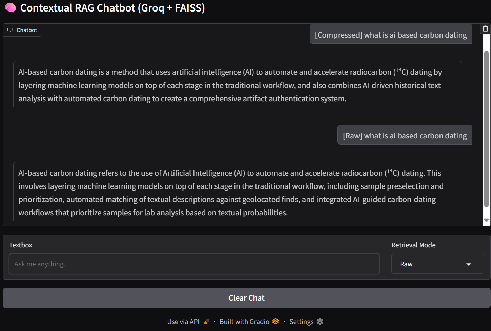

# 🧠 Contextual RAG Chatbot (Groq + FAISS)

This project is a **Retrieval-Augmented Generation (RAG) chatbot** that uses:

- **Groq LLM** (`llama-3.3-70b-versatile`) for reasoning and answering questions  
- **FAISS** for vector search  
- **Sentence Transformers** (`all-MiniLM-L6-v2`) for embeddings  
- **Gradio** for an interactive chatbot UI  
- **Contextual Compression Retriever** with a custom Groq-based compressor for more precise answers  

---

## 📌 Features
- Upload or use a text file (`notes.txt`) as your knowledge base.  
- Splits the text into chunks using `RecursiveCharacterTextSplitter`.  
- Stores chunks in **FAISS vector DB** with HuggingFace embeddings.  
- Retrieves relevant context using **FAISS** or **Compressed Retriever (Groq LLM)**.  
- Answers queries **only based on the given context**.  
- Provides two modes:
  - `Compressed`: Uses Groq to extract only the most relevant snippets.  
  - `Raw`: Direct retrieval from FAISS without compression.  

---

